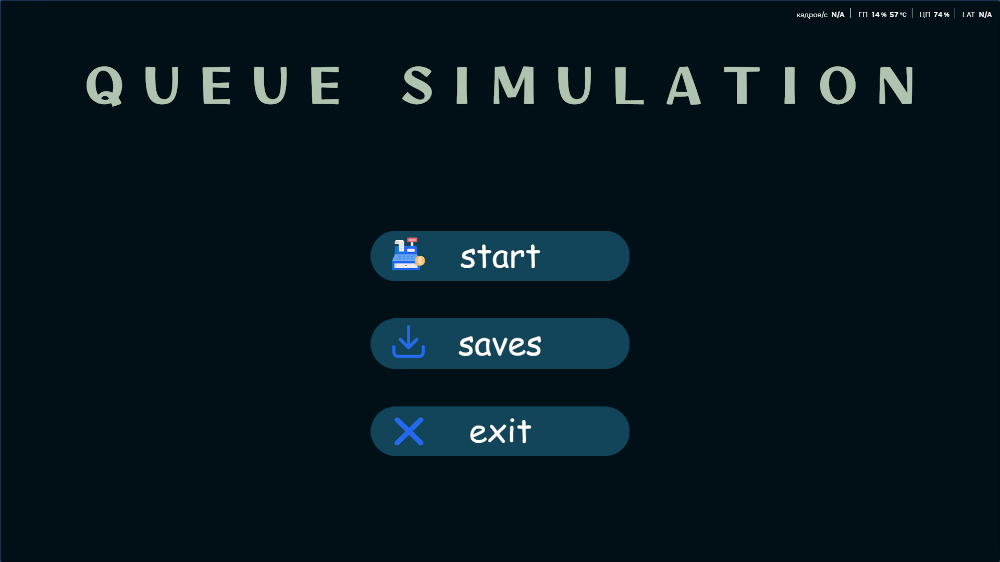
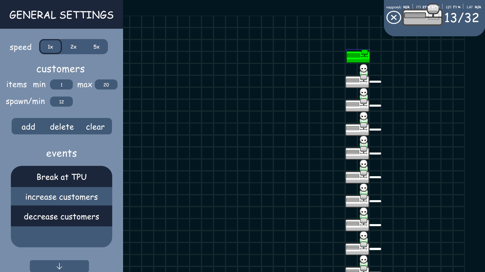
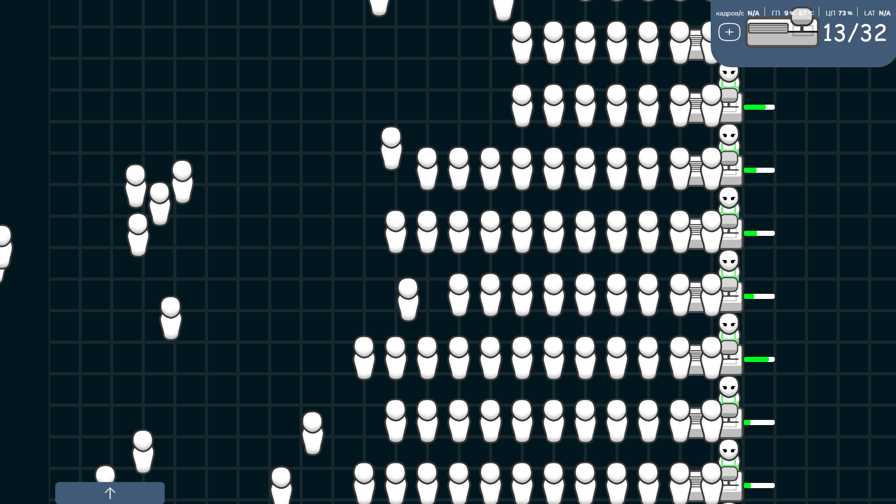

# 🛒 Queue Simulation System (Unity)

Интерактивный симулятор системы обслуживания клиентов с очередями и кассами, разработанный в Unity.  
Проект предназначен для наглядного моделирования и анализа работы кассовых зон в торговых и сервисных предприятиях.

Симулятор позволяет экспериментировать с размещением касс, интенсивностью потока клиентов и параметрами обслуживания, помогая оценить нагрузку, поведение очередей и эффективность выбранной конфигурации.

---

## 🎯 Назначение проекта

Данный проект создан для:
- визуального изучения процессов формирования очередей;
- моделирования работы касс в условиях разной нагрузки;
- прототипирования будущих сервисных точек (магазины, МФЦ, аэропорты);

Приложение помогает понять:
- сколько касс требуется при заданном потоке клиентов;
- как меняется длина очередей при разных параметрах обслуживания;
- как поломки касс и скорость работы влияют на общее время ожидания.

---

## 🧩 Функциональные возможности

### 🔧 Режим редактирования
- Рабочее поле в виде сетки (grid)
- Размещение касс на поле с проверкой валидности
- Ограничение на максимальное количество касс
- Предотвращение пересечений и слишком плотного размещения
- Перемещение и удаление касс
- Сохранение и загрузка конфигурации симуляции в файл

---

### ▶️ Режим симуляции
- Генерация клиентов с настраиваемым интервалом появления
- Случайное количество товаров у клиентов (в заданном диапазоне)
- Интеллектуальный выбор кассы клиентом на основе:
  - расстояния до конца очереди,
  - количества клиентов в очереди,
  - количества клиентов, находящихся в пути
- Физическое формирование очередей в пространстве
- Пошаговое обслуживание клиентов с учётом скорости кассы
- Визуализация прогресса обслуживания (progress bar)
- Случайные поломки касс и автоматический ремонт
- Динамическое перераспределение клиентов между кассами
- Управление скоростью времени симуляции (x1 / x2 / x5)
- Пауза, продолжение и полный сброс симуляции

---

## 🧠 Логика поведения клиентов

- Клиенты появляются в случайной точке входа
- При отсутствии кассы клиент ожидает
- При появлении доступной кассы клиент:
  - оценивает все доступные кассы,
  - выбирает оптимальную по метрике «расстояние + длина очереди»
- Во время движения клиент может:
  - пересчитать оптимальность кассы,
  - сменить очередь при появлении более выгодного варианта
- После обслуживания клиент покидает систему

---

## 🎮 Управление камерой

- **Перемещение камеры** — зажатие колеса мыши
- **Масштабирование** — прокрутка колеса мыши
- Камера ограничена границами сцены
- Разрешение экрана зафиксировано: **1920×1080**

---

## ⌨️ Управление и горячие клавиши

- `Space` — пауза / продолжить симуляцию
- `Tab` — режим расстановки касс
- Клик по кассе — открыть панель настроек кассы

---

## 🖼️ Скриншоты

### Главное меню

### Режим редактирования

### Симуляция

---

## 🛠️ Используемые технологии

- **Unity (2D)**
- **C#**
- Архитектура: Model – View – Controller
- Desktop GUI приложение

---

## 📄 Лицензия

Проект создан в учебных и исследовательских целях.  
Свободен для использования и доработки.

